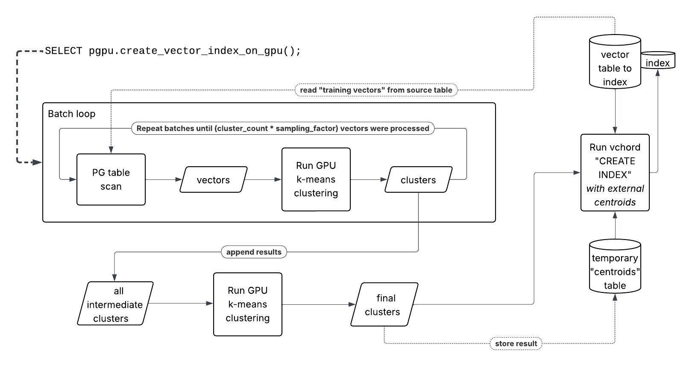

# PGPU - GPU acceleration for PostgreSQL

PGPU is a postgres extension that can use NVIDIA GPUs with CUDA to accelerate certain operations in the database and/or to offload them
from the CPU to the GPU.



## Features
GPU accelerated controids computation for vector indexes using the vectorchord extension.

### Usage examples for vectorchord index build acceleration
### Set up test data and run PGPU
```sql
-- create test tables and generate data
-- 10K table
CREATE TABLE test_10k_vecs
(
   id        bigserial PRIMARY KEY,
   embedding vector(2000)
);


INSERT INTO test_10k_vecs (embedding)
SELECT arr.embedding
FROM generate_series(1, 10000) AS g(i)
        CROSS JOIN LATERAL (
   SELECT array_agg(((g.i - 1) * 3 + gs.j)::real)
   FROM generate_series(1, 2000) AS gs(j)
   ) AS arr(embedding);
```

### Run PGPU
```sql
SELECT pgpu.create_vector_index_on_gpu(table_name => 'public.test_1m_vecs', 
                                       column_name => 'embedding', 
                                       batch_size => 100000, 
                                       cluster_count => 100000, 
                                       sampling_factor => 10, 
                                       kmeans_iterations=>10, 
                                       kmeans_nredo=>1, 
                                       distance_operator=>'ip',
                                       skip_index_build=>true                    
       );
```

## Building and running
See script [scripts/setup_build.sh](scripts/setup_build.sh)

- PGPU uses FAISS for GPU accelerated k-means clustering
- You can build FAISS from source or use the precompiled binaries from [here](https://github.com/facebookresearch/faiss/releases)
- `vectorchord` (aka. `vchord`) and `pgvector` (aka. `vector`) PG extensions need to be installed